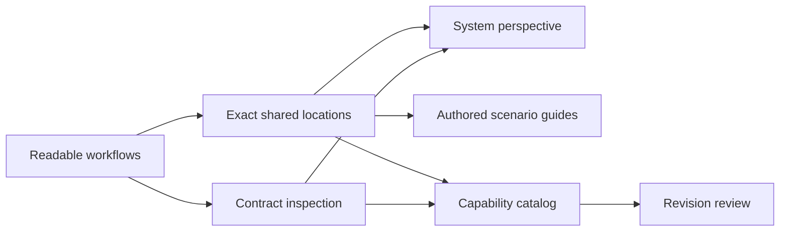

# From workflow viewer to workflow product

## Decision

Deliver seven changes with explicit dependencies. A single change would combine presentation fixes, new public interfaces, source acquisition, metadata interpretation, portfolio indexing, and comparison into one difficult release. Two changes—usability and everything else—would retain most of that risk. Seven separates independently valuable user outcomes and their acceptance evidence while preserving shared foundations.

Assumption: the product direction is an embeddable workflow understanding/review product plus an optional standalone experience. A hosted account/storage/execution platform requires a separate product decision. This roadmap is proposed scope, not an implementation or release commitment.

## Delivery slices

| Order | Change | User outcome | Required predecessor |
| --- | --- | --- | --- |
| 1 | [improve-workflow-reading](proposal.md) | Explain a flow and inspect its exact intent without reconstructing repeated JSON | None |
| 2 | [add-workflow-deep-links](../add-workflow-deep-links/proposal.md) | Share a finding and reopen the exact repeated occurrence | Reading |
| 3 | [inspect-api-contracts](../inspect-api-contracts/proposal.md) | Inspect the actual supplied HTTP/event contract beside its workflow use | Reading for integration |
| 4 | [add-system-interaction-view](../add-system-interaction-view/proposal.md) | Explain business-system exchanges and their explicit workflow implementation | Reading, locations, contracts |
| 5 | [add-authored-scenario-explorer](../add-authored-scenario-explorer/proposal.md) | Follow authored business and recovery cases as a reading guide | Reading, locations |
| 6 | [add-workflow-capability-catalog](../add-workflow-capability-catalog/proposal.md) | Discover product capabilities, responsible teams when supplied, and API/workflow consumers | Reading, locations, contracts |
| 7 | [compare-workflow-revisions](../compare-workflow-revisions/proposal.md) | Review before/after intent and potentially affected supplied consumers | Catalog and its foundations |

Reading, locations, and contract inspection form the first useful product slice. They improve every current example and allow a reviewer to explain, inspect, and share a concrete finding. System/scenario/catalog delivery can then proceed as separate slices once their required interfaces exist. Revision review follows the catalog; it should not delay the first slice. OpenSpec artifact readiness does not satisfy these implementation prerequisites.

## Product promise and review lenses

The proposed promise is: **understand a capability, follow the responsible systems and contracts, inspect data and recovery, and share or review the exact authored evidence.**

Frank Kilcommins' [Arazzo UI introduction](https://jentic.com/blog/announcing-arazzo-ui) informs the workflow-comprehension lens: dependencies, data, and failure handling must be understandable through the UI. Erik Wilde's [workflow API discussion](https://jentic.com/blog/should-workflows-have-their-own-apis) informs the capability lens: workflows should be discoverable and reusable in an API landscape. These are our design lenses, not reviews or endorsements by either author.

Each release must distinguish authored declarations, located contract facts, descriptive associations, and observed execution evidence. Every perspective uses scoped identity; helpers are not automatically systems, actors are not automatically organizational owners, and a received receipt is not automatically a business success. Existing Arazzo calls, goto/retry distinctions, warnings, and finite display limits remain intact.

## Acceptance across personas

| Persona and task | First acceptance slice | Observable evidence |
| --- | --- | --- |
| Owner explains purchase and readiness | Reading, then Systems | Reader identifies reserve → capture evidence → license, and recognizes the purchase's internal implementation |
| Developer inspects exact payment/event declaration | Reading + contracts | Method/path or channel/message, payload/schema, criteria, timeout/correlation, and source revision are visible together |
| Developer traces the second item | Reading + locations | Distinct `second-item` context, 2499 amount, -B purchase mapping; fresh-session link returns to that occurrence |
| Owner reviews decline, uncertainty, and compensation | Reading + scenario guides | Reader distinguishes abort from reconciliation/retry and guarded revoke/refund/release |
| Owner finds responsible capability/consumers | Catalog | Supplied owner or explicit unknown, classified direct/recovery/prerequisite usages, visible scope completeness |
| Owner/Developer reviews a changed contract/policy | Revision review | Exact before/after facts, pinned identities, potential usage paths, and coverage limitations |

Use fresh Playwright evidence for operability and layout. Use unfamiliar-reader sessions for comprehension: record task completion, time/interaction effort, assistance, incorrect interpretations, and quoted explanations only when actually collected. No human completion rate is established by the current automated audit. Release goals are unassisted completion of the critical reading tasks and no incorrect claim of payment, event delivery, or activation success; report failed tasks openly.

## Scope discipline

Source loading and new perspectives remain opt-in. Public interfaces expose small typed values/providers rather than private scene/session machinery. Initial traversal/size limits in the designs are conservative proposed defaults, to be measured against representative documents during implementation. API/contract declarations and package exports receive compatibility checks; diagram syntax tests alone do not establish UX acceptance.

Hosted persistence, authentication, collaborative approval storage, workflow execution, an editor, and universal compatibility verdicts are separate future decisions. Internationalization, additional contract-version adapters, and catalog connectors can follow demonstrated user demand through the same seams; they are not hidden prerequisites of these seven changes.

## Baseline and planning status

The current Playwright baseline is captured in [ux-baseline.md](ux-baseline.md), with selected screenshots and complete audit observation JSON under `browser-evidence/ux-baseline/`. Every change has its own proposal, capability spec, design, and unchecked tasks. Existing archived chaining artifacts and application code were left untouched by this planning work.
