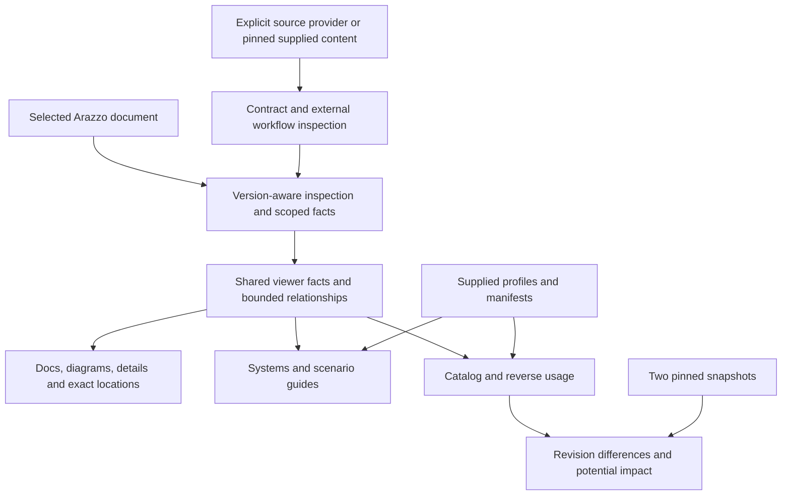

# Arazzo workflow visualization and review

`@jentic/arazzo-ui` lets API Owners and Developers explain a business workflow, follow its API and system interactions, inspect data and recovery rules, share an exact location, and review revisions. This submission combines workflow visualization, contract inspection, Systems, scenario guides, capability discovery, and revision review.

The UI presents authored intent and supplied contract declarations. Execution, message delivery, business outcomes, and compatibility decisions require evidence beyond inspection.

## What a reader can do

| Task | Delivered behavior | Capability contract |
| --- | --- | --- |
| Understand a workflow | Discover all workflows; follow connected local calls; distinguish prerequisites, transfers, and retry recovery; return to the calling occurrence. | [Chained workflows](chained-workflow-visualization/spec.md) |
| Inspect data and recovery | Search authored steps; read parameters, payloads, criteria, outputs, and action provenance in Docs, Sequence, Diagram, and Split. Keyboard and narrow-screen inspection retain context. | [Workflow reading](workflow-reading/spec.md) |
| Share a finding | Restore the document, supplied revision, root workflow, view, and complete call path, including repeated uses of the same helper. | [Exact locations](workflow-locations/spec.md) |
| Inspect an API contract | Explicitly load a supplied HTTP or event contract beside its workflow use; inspect operation declarations, schemas, response or message alternatives, and resolution status. | [Contract inspection](api-contract-inspection/spec.md) |
| Explain system interactions | Use explicit participant and actor bindings to connect API exchanges to their workflow implementations and declared event relationships. | [Systems perspective](system-interaction-perspective/spec.md) |
| Follow a business or recovery case | Navigate an authored scenario's assumptions, expected result, and ordered evidence waypoints. | [Scenario guides](authored-scenario-exploration/spec.md) |
| Discover capabilities and consumers | Search a supplied portfolio by capability, product, owner, lifecycle, workflow, or API; inspect direct uses and classified entry paths. | [Capability catalog](workflow-capability-catalog/spec.md) |
| Review a revision | Compare supplied workflow and contract snapshots; inspect exact before/after values and potential consumer exposure; export the review. | [Revision review](workflow-revision-review/spec.md) |

Ordinary document loading, view selection, workflow navigation, search, and details remain immediately available. Optional setup uses Advanced tools; supplied or restored context reveals the relevant controls and status.

## Example: review a purchase

A reader follows reservation, payment capture, and license provisioning. Selecting `batch-fulfilment.second-item` shows that call's `2499` amount mapping and caller outputs, distinct from the first call to the same helper.

The payment contract appears beside the capture criteria. The reader can inspect reconciliation before retry and share the exact occurrence. A changed response declaration or retry limit links to before/after evidence and known consumer paths, with unavailable sources identified.

## Architecture

The browser UI extends the existing parser and resolver boundaries. It introduces no validator or execution engine.

| Boundary | Responsibility |
| --- | --- |
| Acquisition | Explicit loading, one source authority, revision provenance, budgets, cancellation, and reload. |
| Inspection | Authored content, supported reference meaning, located declarations, and targeted diagnostics. |
| Shared facts | Scoped ownership, declaration/use provenance, action inspection order, and classified relationships. |
| Presentation | Finite diagrams and readable details over unchanged authored documents. |
| Catalog and review | The same facts indexed separately for each supplied revision; classified consumers and before/after coverage. |
| Host integration | Typed inputs and callbacks; standalone history ownership and host-controlled embedding. |

Native snapshots, inspection models, source registries, scenes, and catalog graphs remain private.

## Rules shared by every capability

All capability contracts apply together, with [inspection integrity](workflow-inspection-integrity/spec.md) and [contribution readiness](upstream-contribution-readiness/spec.md) governing their shared behavior and acceptance.

- **Exact context.** Document, supplied revision, owning workflow/step, and ordered call path identify an occurrence. Action addresses retain declaration and use. Stale links select no substitute occurrence.
- **Explicit acquisition.** Secondary loading requires an enabled operation through the supplied authority. Provider configuration or disclosure alone starts no request; denial has no transport fallback. Historic dependencies use pinned supplied content.
- **Explicit ownership.** Owning step/workflow bindings select a Systems actor; an unbound helper remains Unknown. Actor, API source owner, and responsible organization stay distinct.
- **Distinct relationships.** Calls, prerequisites, goto, retry, and descriptive associations retain their classes. Loaded external workflows stay external and open through explicit navigation.
- **Preserved values.** Expressions, falsy values, unknown fields, and opaque extensions remain intact. Literal examples and defaults create no reference-dependency edges.
- **Justified impact.** Workflow defaults retain effective step users and exclude overridden uses. Findings start from known users or explicit document scope; unrelated entries stay out.
- **Visible limits.** Recursion, budgets, unsupported semantics, and partial coverage have explanations. Empty partial results prove no absence of consumers.
- **Accurate claims.** Contract alternatives are declarations; guides are authored expectations; review paths are potential exposure. Viewing and exporting create no execution, approval, or test result.

## Supported inputs and integration

Inspection covers Arazzo 1.0 and selected 1.1 features, supported OpenAPI 3.0/3.1 operations, and AsyncAPI 3 operations. Unsupported versions, `$self`, anchors, and schema-dialect semantics retain authored evidence and targeted limitations. Full Arazzo 1.1 validation and execution are unestablished.

Existing embedded/standalone entries, ESM/UMD surfaces, stylesheet, modes, and callbacks remain supported. Catalog has a typed ESM-only entry; revision review supplies an optional ESM component and comparison/export utilities. Typed locations, providers, profiles, manifests, and snapshots define integration. The [package README](../../packages/jentic-arazzo-ui/README.md) specifies entry-specific usage.

Accounts, hosted persistence, organization-wide discovery, editing, execution replay, and automated compatibility or approval decisions are outside this submission.

## Acceptance and upstream review

Acceptance requires lint, tests/types, UI builds, declaration and installed-package consumers, and production-browser checks at desktop and 480-pixel widths. It covers loading, repeated calls, unknown actors, scenarios, operation entry paths, revision inspection, focus, and history. Package measurements separate whole-file size from initial/deferred downloads.

One product scope is prepared as eight dependency-ordered slices: chaining, reading, locations, contracts, Systems, scenarios, catalog, and revision review. Each prefix must build independently and satisfy DCO and commit conventions. Original history and excluded tooling/evidence remain recoverable.

The [2026-10-09 handoff](../changes/archive/2026-10-09-prepare-arazzo-ui-for-upstream/readiness.md) identifies the locally tested source and prepared series. Human comprehension validation and maintainer agreement remain pending. Spec synchronization adds no engineering or approval evidence.

## Source changes

Ten capability contracts consolidate nine changes, preserving 78 requirements and 195 scenarios. Archived records retain their historical context; main specs define the combined behavior.

| Source change | Main specification |
| --- | --- |
| [Visualize chained workflows](../changes/archive/2026-10-05-visualize-chained-workflows/proposal.md) | [chained-workflow-visualization](chained-workflow-visualization/spec.md) |
| [Improve workflow reading](../changes/archive/2026-10-05-improve-workflow-reading/proposal.md) | [workflow-reading](workflow-reading/spec.md) |
| [Add workflow deep links](../changes/archive/2026-10-05-add-workflow-deep-links/proposal.md) | [workflow-locations](workflow-locations/spec.md) |
| [Inspect API contracts](../changes/archive/2026-10-06-inspect-api-contracts/proposal.md) | [api-contract-inspection](api-contract-inspection/spec.md) |
| [Add system interaction view](../changes/archive/2026-10-07-add-system-interaction-view/proposal.md) | [system-interaction-perspective](system-interaction-perspective/spec.md) |
| [Add authored scenario explorer](../changes/archive/2026-10-07-add-authored-scenario-explorer/proposal.md) | [authored-scenario-exploration](authored-scenario-exploration/spec.md) |
| [Add workflow capability catalog](../changes/archive/2026-10-07-add-workflow-capability-catalog/proposal.md) | [workflow-capability-catalog](workflow-capability-catalog/spec.md) |
| [Compare workflow revisions](../changes/archive/2026-10-07-compare-workflow-revisions/proposal.md) | [workflow-revision-review](workflow-revision-review/spec.md) |
| [Prepare Arazzo UI for upstream](../changes/archive/2026-10-09-prepare-arazzo-ui-for-upstream/proposal.md) | [workflow-inspection-integrity](workflow-inspection-integrity/spec.md), [upstream-contribution-readiness](upstream-contribution-readiness/spec.md) |
